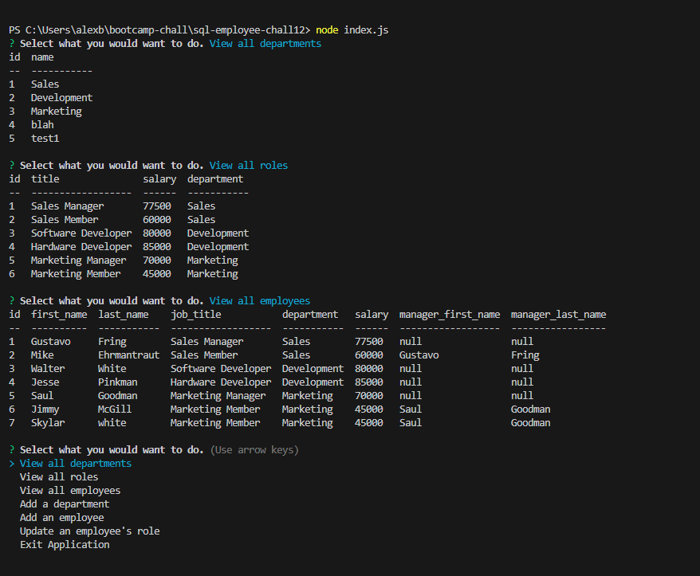

# Employee Tracker
This is my employee tracker for challenge 12 of my bootcamp

This uses a CLI to track employees, and add / update their info in your database.

In the future there will be additions to be able to delete, and more functionality when it comes to updating their information (currently have to input a placeholder manager id instead of being able to leave it blank)

There were a lot of issues, I had originally used try and catch functions and I had found out that they are not compatible with mysql due to the information that they return. This project just also took a long time to work on (I also procrastinated). I had to refactor a majority of my queries.js and my index.js to be compatible with mysql.

Thank you to Tom Hearne and Matt Bronstein for teaching my class. Thank you to Xpert Learning Assistant for helping me a lot when it comes to file structure, and also helping me get starter code that would give me a good head start on my coding. Thank you to Andrew Mell and Nate Master for letting me bounce some questions off of them and help me with my coding.

Screenshots:

github repo:

https://github.com/AlexBlaylock/sql-employee-chall12

video link:
https://drive.google.com/file/d/1ySZEe2NsTJbyuW5pUBh19IUzzgQENwV5/view